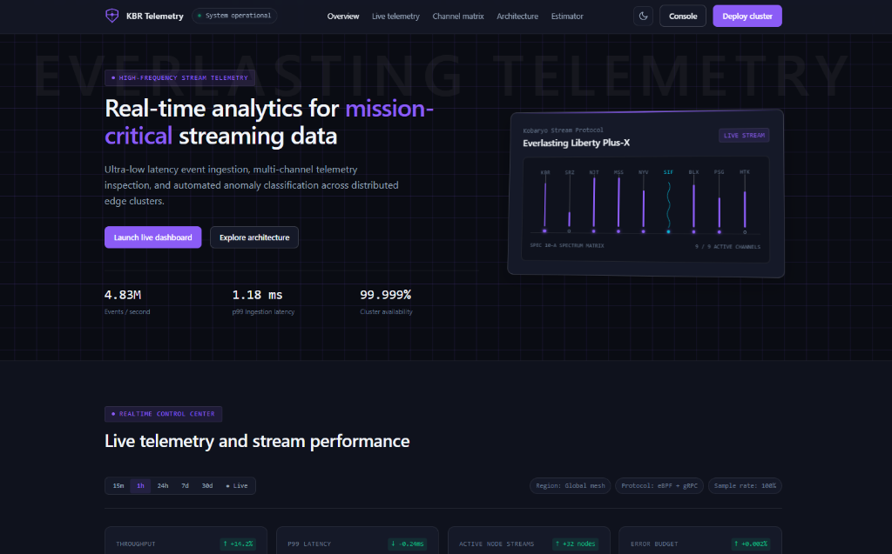
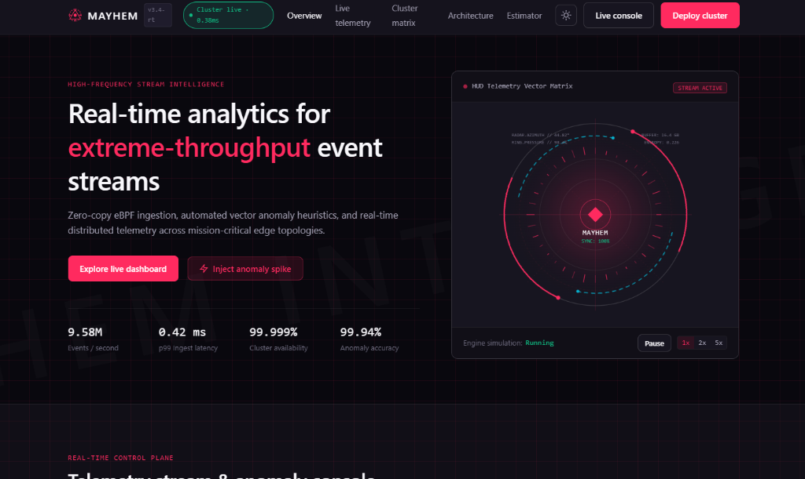

<p align="center">
  <h1 align="center">⚡ Antigravity Elite Harness</h1>
  <p align="center">
    <strong>Инженерные стандарты уровня Claude, 7-векторное код-ревью и дизайн-система без AI-мусора для Google Antigravity.</strong>
  </p>
</p>

<p align="center">
  <a href="README.md">English</a> •
  <a href="README.ru.md"><b>Русский</b></a>
</p>

<p align="center">
  
  
  
  
</p>

---

## 🚀 Обзор

**Antigravity Elite Harness** — это производственный набор глобальных правил и специализированных навыков (Skills), созданный для превращения вашего агента в **Google Antigravity** в элитного парного программиста и UI-дизайнера.

Объединяя **7-векторную методологию ревью от Anthropic**, **строгие инженерные инварианты против костылей** и **калиброванную дизайн-систему**, этот набор навсегда устраняет:
- ❌ Хрупкие костыли вида `if (id === 'one-that-broke')` и скрытые ошибки в тестах.
- ❌ Уродливый «нейросетевой дизайн» (кислотные фиолетовые градиенты, тяжелые тени, размытия, эмодзи вместо иконок).
- ❌ Самовольные переписывания архитектуры и выдуманные API.

---

## 🎨 Галерея интерфейсов (Zero AI Slop)

Все представленные ниже интерфейсы были сгенерированы **автономно за один запрос** агентом Antigravity с использованием навыка `ui-design-system`:

### 1. Cyber Telemetry Spectrum (Эстетика Kobaryo / Everlasting Liberty)
> *9-канальный спектроанализатор, живой осциллограф SIF, CSS 3D-перспектива карточек и токенизированные светлая и тёмная темы.*



### 2. Mayhem HUD Vector Matrix
> *HUD-телеметрия экстремальной пропускной способности, анимированный круговой радар и мониторинг задержки p99.*



---

## 📦 Что внутри

| Компонент | Тип | Назначение |
| :--- | :--- | :--- |
| **`AGENTS.md`** | **Глобальное правило** | 9 строгих инженерных законов: запрет костылей (Altitude check), подражание стилю репозитория, дисциплина инструментов (`Cwd` вместо `cd`), честные отчёты об ошибках. |
| **`ui-design-system`** | **Навык (Skill)** | Премиальные стандарты UI/UX: веса шрифтов только 400/500, контрастность WCAG AA, палитры HSL/OKLCH и обязательный Dark Mode через CSS-переменные. |
| **`code-review`** | **Навык (Skill)** | 7-векторный аудит diff (построчный скан, проверка удаленного поведения, поиск зависимостей, переиспользование кода, conventions) + верификация `CONFIRMED/PLAUSIBLE/REFUTED`. |
| **`architect-planner`** | **Навык (Skill)** | Read-Only архитектор: блокирует запись файлов, исследует зависимости и формирует `implementation_plan.md` до написания кода. |

---

## ⚡ Быстрая установка в 1 клик

### Windows (PowerShell)
Откройте PowerShell и выполните:
```powershell
irm https://raw.githubusercontent.com/42Nekit123/antigravity-elite-harness/main/install.ps1 | iex
```
*(Или клонируйте репозиторий и запустите `./install.ps1`)*

### macOS / Linux (Bash)
```bash
curl -fsSL https://raw.githubusercontent.com/42Nekit123/antigravity-elite-harness/main/install.sh | bash
```

---

## 🛠️ Как использовать

### 1. Автоматическая фоновая защита (Всегда активна)
После установки файл `AGENTS.md` автоматически внедряется в каждый шаг любого диалога в Antigravity. Агент сам:
- Читает соседние файлы перед написанием кода, чтобы скопировать стиль, плотность комментариев и форматирование.
- Отказывается от временных заплаток и правит причину проблемы в корне.
- Честно сообщает точный стек-трейс упавшего теста вместо попыток замаскировать ошибку.

### 2. Глубокое многовекторное код-ревью
Перед коммитом или отправкой PR просто напишите в чат:
```text
"Сделай code-review моих изменений" или "Проверь ветку на баги"
```
Агент запустит 7-векторный анализ:
1. **Построчный скан**: Проверка инверсий, утечек null, забытых `await`, проглоченных ошибок в `catch`.
2. **Аудит удаленного поведения**: Проверка того, где восстанавливаются инварианты удаленного кода.
3. **Кросс-файловый трейсер**: Проверка всех вызывающих функций на нарушение контракта.
4. **Проверка высоты (Altitude)**: Выявление костылей на уровне общей инфраструктуры.
5. **Фаза верификации**: Присвоение статуса `CONFIRMED` или `PLAUSIBLE`, отсеивание ложных срабатываний.

### 3. Генерация скандинавского минималистичного UI
Когда нужно создать сайт, дашборд или компонент, просто напишите:
```text
"Создай дашборд для аналитики с поддержкой светлой и тёмной темы"
```
Агент активирует `ui-design-system`, обеспечивая:
- Порядок сборки от токенов (`:root` -> Base -> Primitives -> Components -> Pages).
- Сдержанную типографику (только веса 400 и 500, sentence case).
- Полный запрет дешевых градиентов, тяжелых теней и эмодзи-заполнителей.

---

## 📁 Структура репозитория

```
antigravity-elite-harness/
├── AGENTS.md                  # Глобальные инженерные правила
├── skills/
│   ├── ui-design-system/      # Дизайн-система без нейросетевого мусора
│   ├── code-review/           # 7-векторный навык код-ревью
│   └── architect-planner/     # Read-Only навык архитектора
├── assets/                    # Скриншоты для витрины
├── examples/                  # 4 готовых интерактивных дашборда
│   ├── 01-kbr-telemetry/
│   ├── 02-mayhem-hud/
│   ├── 03-dimension-analytics/
│   └── 04-market-flux/
├── install.ps1                # Скрипт установки для Windows
├── install.sh                 # Скрипт установки для macOS/Linux
├── README.md                  # Документация на английском
└── README.ru.md               # Документация на русском
```

---

## 🤝 Вклад в проект и обратная связь

Pull Requests, новые специализированные навыки и улучшения правил приветствуются! Если этот набор помог улучшить работу вашего агента, поставьте ⭐ репозиторию!

## 📄 Лицензия
MIT License. Бесплатно для личного и коммерческого использования.
